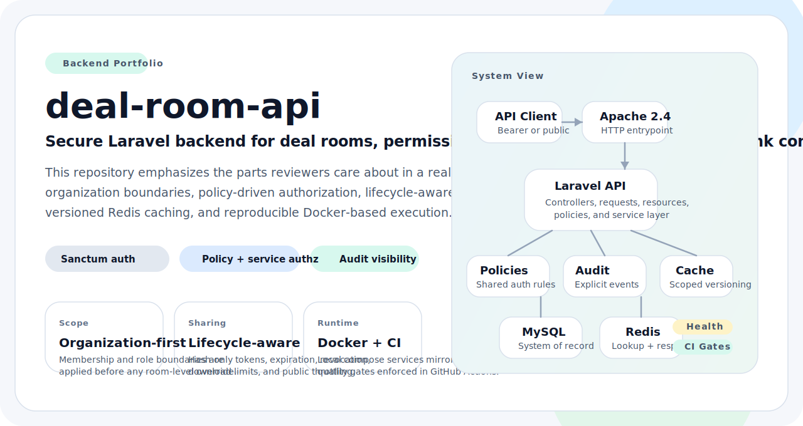
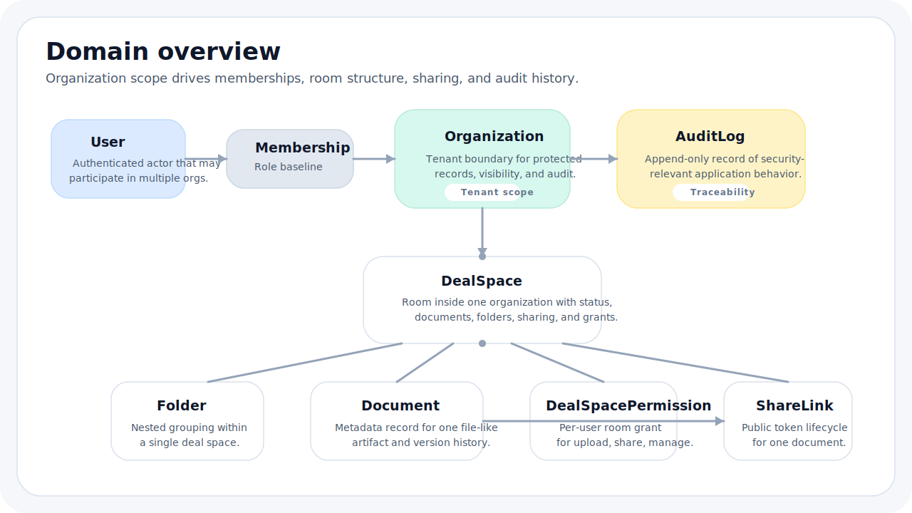

# deal-room-api

> Secure Laravel backend for organization-scoped deal rooms, permission-aware collaboration, and audit-grade access visibility.

<p align="center">
  
</p>

A backend portfolio repository focused on the parts that make a secure API credible: tenant boundaries, policy-backed authorization, controlled public sharing, explicit audit events, scoped Redis caching, and reproducible Docker workflows.

| Focus | Runtime | Data Plane | Delivery |
| --- | --- | --- | --- |
| Permissions, auditability, secure sharing | PHP 8.3, Laravel 10, Sanctum | MySQL 8.4, Redis 7 | Docker Compose, Apache, GitHub Actions |

## Quick Navigation
- [Why This Repository Matters](#why-this-repository-matters)
- [Domain Overview](#domain-overview)
- [Access Model and Security Model](#access-model-and-security-model)
- [Capability Matrix](#capability-matrix)
- [API Overview](#api-overview)
- [Local Workflow](#local-workflow)
- [Validation and Quality](#validation-and-quality)
- [Repository Structure](#repository-structure)
- [Docs Map](#docs-map)
- [Scope Boundaries](#scope-boundaries)
- [Future Improvements](#future-improvements)

## Why This Repository Matters
This repository is intentionally more than a CRUD demo. It models a security-sensitive workspace where access decisions, external sharing, and traceability are part of the core design rather than afterthoughts.

- Organization membership is a hard boundary in both the schema and the request layer.
- Authorization combines Laravel policies with a shared `AuthorizationService`, keeping access rules explicit and testable.
- Public document sharing is treated as a lifecycle: hashed tokens, expiry, revocation, download limits, throttling, and audit events.
- Redis is used for scoped cache acceleration and versioned invalidation instead of broad cache flushes.
- Docker Compose and GitHub Actions make the same workflow easy to run locally and verify in CI.

## Domain Overview
`deal-room-api` models a transaction workspace as an organization-scoped system of memberships, deal spaces, document structures, controlled share links, and append-only security events.

<p align="center">
  
</p>

| Entity | Responsibility | Important behavior |
| --- | --- | --- |
| `Organization` | Tenant boundary for every protected record | Owns memberships, deal spaces, folders, documents, share links, and audit logs |
| `Membership` | Joins users to organizations | Carries baseline role: `owner`, `admin`, `member`, `viewer` |
| `DealSpace` | Working room inside an organization | Holds folders, documents, share links, and per-room grants |
| `DealSpacePermission` | Per-user override inside one deal space | Effective grants today are `upload`, `share`, and `manage`; `view` is stored but read access already comes from organization membership |
| `Folder` | Nested document grouping | Supports parent-child trees inside one deal space |
| `Document` | Metadata record for a file artifact | Tracks filename, MIME type, size, checksum, metadata, version, and upload time |
| `ShareLink` | Public access handle for one document | Stores hash only, enforces expiry, revocation, download limits, and access counters |
| `AuditLog` | Append-only event trail | Captures actor, target, organization, request metadata, and structured context |

Documents are metadata-only in the current scope. The repository does not claim binary object storage or file streaming support.

## Access Model and Security Model
Protected access is organization-scoped first, then narrowed or elevated through role checks and selected deal-space grants.

<p align="center">
  
</p>

Decision order:
1. Confirm the caller is a member of the target organization.
2. Apply the membership role baseline.
3. Apply effective deal-space grants where the policy supports them.
4. For public share links, bypass authentication but enforce token lifecycle checks, throttling, and audit logging.

| Role | Organization | Memberships | Deal spaces | Folders and documents | Share links | Audit logs |
| --- | --- | --- | --- | --- | --- | --- |
| `owner` | Full control, including delete | Manage | Manage, including permission grants | Manage | Manage | Read |
| `admin` | Operational control, no organization delete | Manage | Manage, including permission grants | Manage | Manage | Read |
| `member` | Read | No | Read | Create, update, delete | Create and revoke | No |
| `viewer` | Read | No | Read | Read only | No baseline access | No |

| Deal-space grant | Effective behavior today |
| --- | --- |
| `upload` | Enables folder and document mutations inside the granted deal space |
| `share` | Enables share-link creation and revocation inside the granted deal space |
| `manage` | Enables deal-space updates, grant management, document and folder mutations, and share-link management |
| `view` | Stored and validated, but current read access already comes from organization membership, so it does not widen access on its own today |

Public share-link protections in the current implementation:
- Tokens are generated randomly and only the SHA-256 hash is persisted.
- Resolution fails when the link is expired, revoked, unknown, or over its download limit.
- Successful public resolution increments `download_count` inside a database transaction.
- Login and public share-link resolution are rate limited.
- Create, resolve, and revoke actions are written to the audit log.

## Capability Matrix
| Area | Implemented in this repository | Where to look |
| --- | --- | --- |
| Authentication | Sanctum login/logout and authenticated `me` endpoint | [docs/security.md](docs/security.md), [docs/api-overview.md](docs/api-overview.md) |
| Authorization | Laravel policies backed by `AuthorizationService` | [docs/security.md](docs/security.md), [docs/architecture.md](docs/architecture.md) |
| Organizations and memberships | Organization CRUD, membership CRUD, role enforcement | [docs/domain-model.md](docs/domain-model.md), [docs/api-overview.md](docs/api-overview.md) |
| Deal spaces, folders, and documents | Deal-space CRUD, per-room grants, nested folders, document metadata records | [docs/domain-model.md](docs/domain-model.md), [docs/api-overview.md](docs/api-overview.md) |
| Share links | Tokenized public access with expiry, revocation, limits, and audit trail | [docs/security.md](docs/security.md), [docs/api-overview.md](docs/api-overview.md) |
| Audit logs | Organization-scoped event querying for privileged roles | [docs/security.md](docs/security.md), [docs/domain-model.md](docs/domain-model.md) |
| Redis caching | Versioned cache keys for list/detail reads and short-lived share-link lookup cache | [docs/architecture.md](docs/architecture.md) |
| Dockerized runtime | `app`, `apache`, `mysql`, and `redis` local stack with health checks | [docs/local-development.md](docs/local-development.md), [docs/deployment-notes.md](docs/deployment-notes.md) |
| Tests, CI, and static analysis | PHPUnit, Pint, PHPStan, migrations, and Docker build verification in CI | [docs/local-development.md](docs/local-development.md), [docs/architecture.md](docs/architecture.md) |

## API Overview
The API is versioned under `/api/v1`. The README keeps the surface summary short and leaves endpoint detail, query parameters, and examples to [docs/api-overview.md](docs/api-overview.md).

| Family | Route surface | Purpose |
| --- | --- | --- |
| Auth | `POST /auth/login`, `POST /auth/logout`, `GET /me` | Token issuance, revocation, and caller identity |
| Organizations | `GET/POST/PUT/DELETE /organizations` | Tenant creation and organization lifecycle |
| Memberships | `GET/POST/PUT/DELETE /memberships` | Role assignment inside organizations |
| Deal spaces | `GET/POST/PUT/DELETE /deal-spaces` | Room lifecycle inside an organization |
| Deal-space grants | `GET/PUT /deal-spaces/{deal_space}/permissions` | Per-user permission overrides for one room |
| Folders and documents | `GET/POST/PUT/DELETE /folders`, `GET/POST/PUT/DELETE /documents` | Nested structure and metadata management |
| Share links | `GET/POST/DELETE /share-links`, public `GET /share-links/{token}` | Controlled external access to one document |
| Observability | `GET /audit-logs`, `GET /health` | Audit retrieval and dependency health |

<p align="center">
  
</p>

## Local Workflow
Quick start:

```bash
cp .env.example .env
docker compose up -d --build
docker compose exec app composer install
docker compose exec app php artisan key:generate
docker compose exec app php artisan migrate --seed
curl http://localhost:8080/api/v1/health
```

Day-to-day commands:

```bash
make up
make down
make restart
make logs
make shell
make migrate
make seed
make fresh
make test
make lint
make stan
make quality
make health
```

Seeded demo accounts all use `Password123!`:
- `owner@acme.test`
- `admin@acme.test`
- `member@acme.test`
- `viewer@acme.test`
- `owner@northwind.test`

Local workflow details, ports, and smoke tests are documented in [docs/local-development.md](docs/local-development.md).

## Validation and Quality
| Check | Purpose | Command or signal |
| --- | --- | --- |
| Pint | Enforces consistent formatting | `docker compose exec app vendor/bin/pint --test` |
| PHPStan | Checks static type and flow issues | `docker compose exec app vendor/bin/phpstan analyse --memory-limit=512M` |
| PHPUnit | Verifies auth, authorization, CRUD flows, share links, audit logs, and health behavior | `docker compose exec app php artisan test` |
| Composer quality gate | Runs lint, static analysis, and tests together | `docker compose exec app composer quality` |
| Health endpoint | Confirms Laravel can reach MySQL and Redis | `curl http://localhost:8080/api/v1/health` |
| Docker runtime | Confirms container health and service wiring | `docker compose ps` |
| GitHub Actions CI | Repeats migrations, Pint, PHPStan, PHPUnit, and Docker build verification | [`.github/workflows/ci.yml`](.github/workflows/ci.yml) |

## Repository Structure
```text
.
|-- app/
|   |-- Enums/
|   |-- Http/
|   |   |-- Controllers/Api/V1/
|   |   |-- Requests/
|   |   `-- Resources/
|   |-- Models/
|   |-- Policies/
|   `-- Services/
|-- assets/
|   `-- readme/
|       |-- hero.svg
|       |-- domain-overview.svg
|       |-- access-model.svg
|       `-- request-flow.svg
|-- database/
|   |-- factories/
|   |-- migrations/
|   `-- seeders/
|-- docker/
|   |-- apache/
|   `-- php/
|-- docs/
|-- routes/
|-- tests/
|-- docker-compose.yml
|-- Makefile
`-- .github/workflows/ci.yml
```

## Docs Map
| Document | Purpose |
| --- | --- |
| [docs/architecture.md](docs/architecture.md) | Runtime topology, application layers, cache behavior, and audit boundaries |
| [docs/domain-model.md](docs/domain-model.md) | Entity relationships, integrity rules, and lifecycle notes |
| [docs/api-overview.md](docs/api-overview.md) | Endpoint families, filters, conventions, examples, and rate limits |
| [docs/security.md](docs/security.md) | Authentication, authorization, share-link controls, audit coverage, and hardening notes |
| [docs/local-development.md](docs/local-development.md) | Docker stack, ports, setup, demo accounts, and smoke tests |
| [docs/deployment-notes.md](docs/deployment-notes.md) | What ships in-repo today and how to translate it into a production baseline |
| [docs/roadmap.md](docs/roadmap.md) | Realistic next steps that extend the current scope without misrepresenting the implementation |

## Scope Boundaries
- Documents are metadata records only. Binary upload, storage, and streaming are intentionally outside the implemented scope.
- The repository ships a local Docker Compose stack, not a full production deployment or infrastructure-as-code package.
- External identity providers, MFA flows, and token scopes are not implemented.
- Endpoint behavior is documented in Markdown; an OpenAPI artifact is not generated yet.
- There is no background job pipeline, object storage adapter, or webhook delivery path in the current codebase.

## Future Improvements
- Generate an OpenAPI document and publish a Swagger or Redoc view for reviewers.
- Add object storage integration when the project expands beyond metadata-only documents.
- Introduce background jobs for heavier audit exports and reporting workflows.
- Extend authentication with token scopes or MFA-ready integration points.
