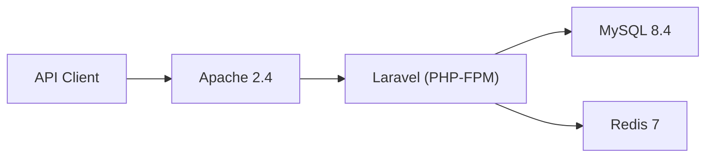
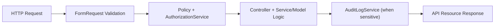

# Architecture

## Context
`deal-room-api` is an API-first backend for secure, organization-scoped document collaboration in transaction workflows. It focuses on controlled access, traceability, and maintainable backend design.

## Architecture goals
- Keep authorization explicit and testable.
- Keep mutation behavior auditable.
- Keep controller code thin and readable.
- Keep local and CI execution reproducible through Docker.

## Runtime topology
- `apache`: HTTP entrypoint, serves `public/`, forwards PHP execution to FPM.
- `app`: Laravel runtime (PHP-FPM 8.3), Artisan, Composer, test/lint tooling.
- `mysql`: relational source of truth for transactional domain data.
- `redis`: caching and short-lived lookup acceleration.

## Application layout
- `app/Http/Controllers/Api/V1`: HTTP orchestration
- `app/Http/Requests`: validation and request contracts
- `app/Policies`: authorization rules
- `app/Services`: domain-level business behavior
- `app/Http/Resources`: response transformation
- `app/Models`: persistence mapping and relationships
- `database/migrations`: schema and indexes
- `database/seeders`: deterministic demo data

## Authorization model
Authorization decisions are centralized in `AuthorizationService`, invoked by policies.

Decision chain:
1. Confirm organization membership.
2. Evaluate membership role (`owner`, `admin`, `member`, `viewer`).
3. Evaluate optional deal-space overrides (`view`, `upload`, `share`, `manage`).

This keeps authorization logic reusable across controllers and easy to regression-test.

## Share-link design
- Share-link tokens are generated randomly and returned once.
- Persisted value is a SHA-256 hash only (`token_hash`).
- Resolution runs inside a DB transaction with row lock to safely increment download counters.
- Resolution validates: not revoked, not expired, and below download limit.
- Public resolution endpoint is rate-limited and backed by short-lived token-hash lookup cache.

## Caching strategy
`CacheVersionService` implements versioned cache keys:
- Key shape: `cache:{domain}:{scope}:v{n}:{params-hash}`
- Read-heavy endpoints call `remember(...)`.
- Writes call `bump(domain, scope)` for deterministic invalidation.
- Scope is chosen by data visibility:
  - user-scoped lists (`organization-list`, `deal-space-list`, etc.)
  - entity-scoped detail views (`document-show`, `deal-space-show`, etc.)

## Request lifecycle
1. Request enters Apache and is forwarded to Laravel.
2. Form Request validates input and query constraints.
3. Policy authorization runs through `AuthorizationService`.
4. Controller delegates to model/service logic.
5. Sensitive mutations are recorded via `AuditLogService`.
6. Response is shaped by API Resource classes.

## Quality controls
- Formatting: `vendor/bin/pint`
- Static analysis: `vendor/bin/phpstan analyse`
- Tests: PHPUnit feature + unit suites
- CI workflow runs lint, static analysis, migrations, tests, and Docker build checks
