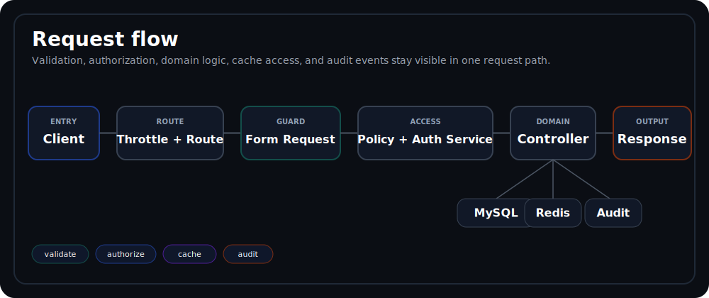

# Architecture

`deal-room-api` is designed as an API-first Laravel service where organization isolation, explicit authorization, auditable mutations, and predictable local execution are first-class concerns.

## Design Priorities
- Keep tenant boundaries visible in schema design, controller contracts, and query shape.
- Keep authorization centralized enough to reason about and regression-test.
- Keep public sharing explicit, bounded, and lifecycle-driven.
- Keep the runtime small enough to run locally, but structured enough to resemble a production backend.

## Runtime Topology
| Service | Responsibility | Notes |
| --- | --- | --- |
| `apache` | Public HTTP entrypoint | Binds `localhost:8080` and serves Laravel through `public/` |
| `app` | PHP-FPM 8.3 Laravel runtime | Runs Artisan, Composer, Pint, PHPStan, and PHPUnit |
| `mysql` | Relational source of truth | Stores organizations, memberships, deal spaces, documents, share links, and audit logs |
| `redis` | Cache and lookup acceleration | Holds versioned API cache entries and short-lived share-link lookup state |

The health endpoint at `GET /api/v1/health` checks both MySQL and Redis connectivity and reports `ok` or `degraded`.

## Application Layers
| Path | Responsibility | Why it matters |
| --- | --- | --- |
| `app/Http/Controllers/Api/V1` | Request orchestration | Keeps endpoint behavior readable and thin |
| `app/Http/Requests` | Validation and query contracts | Hardens inputs before policy or model work starts |
| `app/Policies` | Authorization entry points | Delegates shared decision logic instead of duplicating rules |
| `app/Services` | Cross-cutting domain logic | Houses audit recording, authorization helpers, cache versioning, and share-link lifecycle behavior |
| `app/Http/Resources` | JSON response shape | Keeps payloads stable and explicit |
| `app/Models` | Persistence mapping and relationships | Encodes the organization-scoped domain model |
| `database/migrations` | Schema and indexes | Enforces integrity and query-friendly constraints |
| `database/seeders` | Deterministic demo dataset | Makes the repository easy to review locally |

## Request Path

1. Apache receives the request and passes it into Laravel.
2. Route middleware applies global API throttling and route-specific limits where configured.
3. Form Requests validate payloads and query parameters.
4. Policies delegate to `AuthorizationService` for membership, role, and deal-space grant checks.
5. Controllers coordinate model or service work and keep mutation behavior explicit.
6. Sensitive actions are recorded through `AuditLogService`.
7. Resources or JSON responses shape the final payload.

## Authorization, Audit, and Cache Interaction
- Organization membership is the primary access boundary.
- Role baselines determine what a caller can do before any deal-space grant is considered.
- Effective deal-space elevation today comes from `upload`, `share`, and `manage`; `view` is stored but current read access already comes from organization membership.
- Audit logging is explicit in controllers rather than hidden behind model events, which makes sensitive flows easier to review.
- `CacheVersionService` keeps cache invalidation deterministic by bumping scoped version keys instead of clearing broad namespaces.

## Persistence and Deletion Behavior
- Organizations, deal spaces, and documents use soft deletes.
- Folders are hard-deleted and enforce unique sibling names inside a single deal space.
- Share links are revoked through `revoked_at`; the public lifecycle is blocked without deleting the record.
- Audit logs are append-only at the application level and do not have an `updated_at` column.

## Caching Strategy
`CacheVersionService` uses the key shape `cache:{domain}:{scope}:v{n}:{params-hash}`.

- User-scoped list caches support endpoints such as organizations, deal spaces, folders, documents, share links, and audit logs.
- Entity-scoped detail caches support show endpoints such as organizations, deal spaces, and documents.
- Write operations bump only the affected version keys.
- Share-link resolution uses a separate short-lived token-hash lookup cache before the database transaction that increments `download_count`.

## Quality Controls
- Formatting is enforced with `vendor/bin/pint`.
- Static analysis runs through PHPStan with Larastan.
- Feature and unit tests cover health, auth, authorization, CRUD flows, share links, and audit behavior.
- GitHub Actions runs dependency install, environment setup, migrations, Pint, PHPStan, PHPUnit, and Docker build verification.

## Related Docs
- [Domain Model](domain-model.md)
- [API Overview](api-overview.md)
- [Security](security.md)
- [Local Development](local-development.md)
