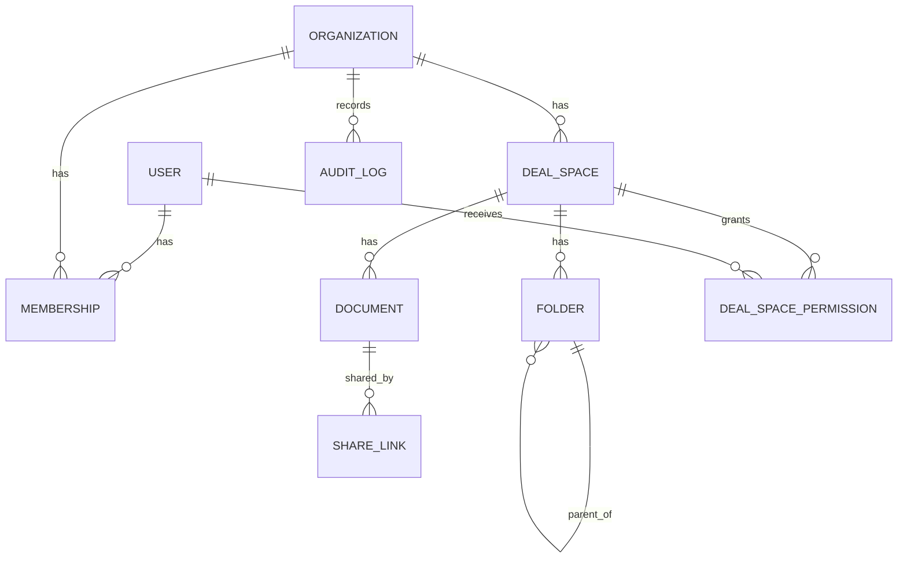

# Domain Model

## Core entities

## User
Authenticated actor with API access.
- Can belong to multiple organizations through memberships.
- Can own organizations and create deal spaces, folders, documents, and share links.

## Organization
Tenant boundary for all sensitive data.
- Owned by `owner_user_id`.
- Parent scope for memberships, deal spaces, documents, share links, and audit logs.

## Membership
Join model between `users` and `organizations`.
- Unique constraint: (`organization_id`, `user_id`)
- Role enum: `owner`, `admin`, `member`, `viewer`
- Governs default access behavior

## DealSpace
Deal room within an organization.
- Belongs to one organization.
- Has folders, documents, share links, and permission overrides.
- Status enum: `draft`, `active`, `closed`

## DealSpacePermission
Optional fine-grained per-user grant inside one deal space.
- Permission enum: `view`, `upload`, `share`, `manage`
- Unique constraint: (`deal_space_id`, `user_id`, `permission`)

## Folder
Hierarchical document grouping.
- Belongs to organization and deal space.
- Supports nested trees via nullable `parent_id`.

## Document
Metadata-only file record.
- Fields include title, filename, MIME type, size, checksum, metadata, version, upload timestamp.
- Belongs to organization and deal space, optional folder.

## ShareLink
External tokenized access handle for one document.
- Stores `token_hash` and short `token_prefix`.
- Enforces `expires_at`, optional `max_downloads`, and `revoked_at`.
- Tracks `download_count` and `last_accessed_at`.

## AuditLog
Immutable security/event trail.
- Captures actor, organization, event key, target model reference, request metadata, and context payload.
- No updates; append-only behavior at application level.

## Relationship view

## Access-control model
- Organization membership is mandatory for protected data.
- Membership role sets baseline capabilities.
- Deal-space permissions can elevate capabilities for a specific deal space.
- Public share-link resolution bypasses membership but is constrained by secure token checks and throttling.

## Integrity and indexing notes
- Foreign keys enforce organization/deal/document ownership chains.
- Composite unique indexes prevent duplicate memberships and duplicate permission rows.
- Query indexes prioritize:
  - membership lookups by `user_id`, `organization_id`
  - list endpoints with date/status filters
  - audit event filtering by organization, actor, and event
  - share-link resolution by `token_hash`
