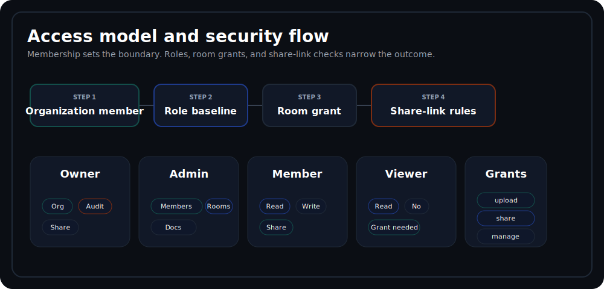

# Security

Security is the main reason this repository is interesting. The implementation treats identity, access boundaries, public sharing, and auditability as part of the product surface rather than incidental infrastructure.

## Security Model

## Authentication
- API authentication uses Laravel Sanctum personal access tokens.
- `POST /api/v1/auth/login` issues a token after credential verification.
- `POST /api/v1/auth/logout` revokes the current token.
- Disabled users receive `403` even if credentials are correct.
- Login attempts are rate limited to `10` per minute per `IP + email`.

## Authorization Decision Order
1. Confirm the caller belongs to the target organization.
2. Apply membership role baseline.
3. Apply the effective deal-space grant for the action being attempted.
4. Reject when none of the above authorize the operation.

| Layer | Implemented behavior | Notes |
| --- | --- | --- |
| Organization membership | Required for every protected resource | Non-members are rejected even if IDs are guessable |
| Membership role | `owner`, `admin`, `member`, `viewer` | Drives baseline access to organization, membership, document, and audit operations |
| Deal-space grants | `upload`, `share`, `manage` elevate behavior inside one room | `view` exists in the enum and validation rules, but current read access already follows organization membership |
| Public share links | Token-based access outside authenticated membership | Enforced by lifecycle checks, throttling, and audit logging |

## Validation and Input Hardening
- Form Requests validate mutation payloads and query contracts at the edge.
- Controllers enforce cross-record consistency such as organization-to-deal-space and folder-to-deal-space ownership.
- Mutation rules constrain enum values, required foreign keys, pagination bounds, and share-link expiry dates.
- Invalid relationship combinations fail early with `422` responses instead of drifting into inconsistent state.

## Share-Link Protections
- Tokens are generated randomly and returned once at creation time.
- Only the SHA-256 hash is persisted in the database.
- Public resolution is denied when the token is unknown, expired, revoked, or over its download limit.
- Successful resolution increments `download_count` inside a transaction with a row lock.
- Public resolution is rate limited to `30` per minute per token hash and `120` per minute per IP.
- Redis is used for short-lived token-hash lookup acceleration before the database transaction.

## Audit Coverage
Sensitive controller actions record explicit events through `AuditLogService`.

Recorded categories in the current implementation:
- Authentication: `auth.login`, `auth.logout`
- Organization lifecycle: `organization.created`, `organization.updated`, `organization.deleted`
- Membership lifecycle: `membership.created`, `membership.updated`, `membership.deleted`
- Deal-space lifecycle and grants: `deal-space.created`, `deal-space.updated`, `deal-space.deleted`, `deal-space.permissions.updated`
- Folder and document lifecycle: `folder.created`, `folder.updated`, `folder.deleted`, `document.created`, `document.updated`, `document.deleted`
- Share-link lifecycle: `share-link.created`, `share-link.resolved`, `share-link.revoked`

Each audit row can include actor, organization, auditable target, IP address, user agent, and structured context.

## Cache Safety
- Cached responses are scoped by domain and visibility boundary.
- Version bumps are explicit on writes, which avoids broad wildcard invalidation.
- Authorization still runs on protected routes before cached payloads are returned.
- Share-link lookup caching does not bypass lifecycle validation; it only avoids repeated token-hash lookups.

## Operational Hardening Notes
- Terminate TLS at the edge in production and pass trusted proxy headers correctly.
- Keep MySQL and Redis on private networks only.
- Use non-debug production settings and rotate all secrets regularly.
- Monitor authentication failures, repeated share-link resolution failures, and unexpected audit-volume spikes.

## Related Docs
- [Architecture](architecture.md)
- [Domain Model](domain-model.md)
- [API Overview](api-overview.md)
- [Deployment Notes](deployment-notes.md)
